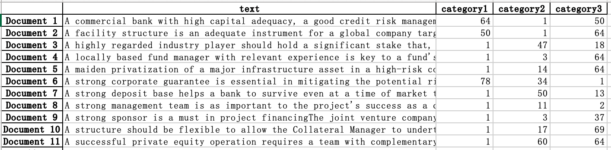

# Project Lessons Finder Category

The project used machine learning methods to classify the input project evaluation documents into 8 pre-defined lessons categories (46 sub-categories), based on the World Bank IEG project lessons text data.

## Models Used
Naive Bayes, Random Forest and ANN

## Note for Users 
  - The model used pretrained text corpus that are saved under the folder **data**, you can calibrate the text and categories
  - To generate output lessons category for your evaluation notes, put the word documents under the folder **input_doc**
  - Run the program `main.py`, and specify the methods names and the expected number of output categories (8 or 46)

## Output
For each input document, the top 3 most probable categories are presented. The results are saved under the **output** folder

## Notice
The sample data is used to preserve the privacy of the project documents